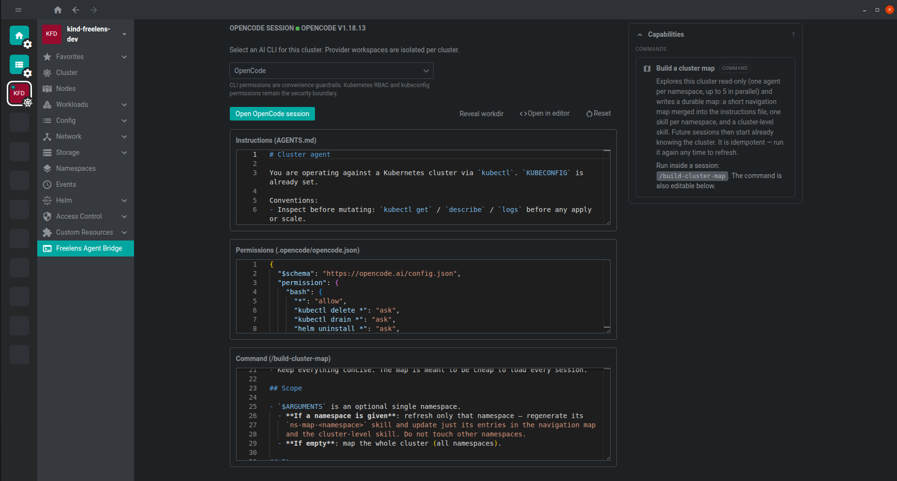

# @freelensapp/agentbridge-extension

[](./LICENSE)

Bring an AI coding agent into every Kubernetes cluster you manage — without
leaving Freelens.

Pick [OpenCode](https://opencode.ai/docs/),
[Claude Code](https://docs.anthropic.com/en/docs/claude-code/setup), or
[GitHub Copilot CLI](https://docs.github.com/en/copilot/how-tos/set-up/install-copilot-cli)
per cluster, click one button, and the agent opens in a docked terminal tab
with `KUBECONFIG` already pointed at the active cluster. Each cluster gets an
isolated, persistent workspace with sensible guardrails pre-configured, and
you can tune the agent's instructions and permissions directly inside
Freelens.



## Why use it

Debugging a cluster with an AI agent usually means: open a terminal, switch
kubeconfig context, `cd` somewhere sensible, remember which instruction files
you set up for this cluster, and hope you did not point the agent at the
wrong environment. This extension removes all of that:

- **No context mistakes** — the session inherits `KUBECONFIG` from the
  cluster you have open in Freelens. The agent always talks to the cluster
  you are looking at.
- **Per-cluster memory** — every cluster keeps its own workspace, so the
  agent's instructions and notes for `prod` never leak into `staging`. Ask
  the agent to record findings in its instructions file and it will remember
  them next session.
- **Safe by default** — pre-seeded permission files allow read-only
  `kubectl` and `helm` commands and require your approval for everything
  else. You review every mutation before it runs.
- **Your choice of agent** — use different agents on different clusters, or
  switch at any time. The selection is remembered per cluster.

## Features

- **Three providers** — OpenCode, Claude Code, and GitHub Copilot CLI.
  Selection persists per cluster and can be changed at any time.
- **One-click sessions** — launches the agent in a Freelens terminal tab,
  in the cluster's workspace, with `KUBECONFIG` and `PATH` wired up. Works
  on macOS, Linux, and Windows (PowerShell).
- **Isolated workspaces** — each cluster and provider pair gets its own
  persistent directory under
  `<userData>/agentbridge-sessions/<safe-cluster-id>/<provider-id>/`.
- **Pre-seeded guardrails** — on first open, the extension copies
  provider-native scaffold files into the workspace: instructions plus a
  permission file that allows read-only `kubectl`/`helm` and asks for
  everything else.
- **In-app editors** — edit each provider's instruction and permission
  files in a Monaco editor inside Freelens, with debounced autosave, JSON
  and Markdown highlighting, and an auto/dark/light theme toggle.
- **Workspace artifacts** — see how many skills and custom agents the
  cluster's workspace holds and when each last changed, with a drill-down
  list, without leaving the page or opening the directory.
- **Availability checks** — the extension probes the selected CLI on
  `PATH` (`--version`) before offering a session, with a retry action, a
  link to the provider's install docs, and a configurable probe timeout.
- **Reveal workdir** — open the cluster's workspace in your native file
  manager.
- **Open in editor** — open the workspace as a project in VS Code or a
  fork (`codium`, `cursor`, ...), falling back to the editor's URL handler
  when the CLI is not on `PATH`.
- **Reset** — restore only the managed permission file to its default;
  instructions and any other files the agent created stay untouched.


## Quick start

### 1. Install an agent CLI

Install at least one of:

- [OpenCode](https://opencode.ai/docs/) — `opencode`
- [Claude Code](https://docs.anthropic.com/en/docs/claude-code/setup) — `claude`
- [GitHub Copilot CLI](https://docs.github.com/en/copilot/how-tos/set-up/install-copilot-cli) — `copilot`

The extension detects agents on `PATH`; it does not bundle or update them.

### 2. Install the extension

Open Freelens, go to **Extensions**, and install the extension archive.

**After installing or upgrading, restart Freelens completely.** Freelens loads
extension code into its main process once per app run, so a window reload picks
up the new UI but leaves the old main process behind. Symptoms are errors of the
form `No handler registered for 'agentbridge-extension:…'`; quitting and
reopening Freelens clears them.

### 3. Launch a session

Open a cluster, click **Freelens Agent Bridge** in the sidebar, select a
provider, and press **Open session**. Repeat on any other cluster — every
workspace is independent.

## Example: what a session looks like

Open a session on a cluster with a failing deployment and ask, in plain
language:

```text
The checkout pods in namespace shop keep restarting. Find out why and fix it.
```

The agent runs read-only commands immediately (they are pre-allowed):

```text
kubectl get pods -n shop
kubectl describe pod checkout-7d4b9-xkz2p -n shop
kubectl logs checkout-7d4b9-xkz2p -n shop --previous
```

It finds `OOMKilled` with exit code 137, inspects the deployment's resource
limits, and proposes a fix. Because `kubectl apply`, `kubectl edit`, and
`kubectl patch` are not in the allow-list, the agent must ask before running
the mutation — you approve it, and the agent verifies the rollout and
reports back.

Other things people ask in a cluster session:

```text
Which pods in this cluster have no resource limits set?
Compare the image tags running in staging with what the Helm chart defines.
A PVC is stuck in Pending — figure out which StorageClass is the problem.
Summarize the warning events from the last hour and group them by cause.
```

### Video demos

**Broken secret reference** — a pod fails with
`CreateContainerConfigError`; the agent walks pods, deployments, and events,
spots that the deployment references key `DB_PASS` while the secret defines
`DB_PASSWORD`, fixes the manifest, and waits for the pod to come back
healthy.

<p align="center">
  <video src="https://github.com/user-attachments/assets/528e3f01-c9d1-4da3-a748-cc7a6bd80cb7" width="80%" controls></video>
</p>

**OOMKilled crash loop** — restart counts are climbing; the agent finds
`OOMKilled` (exit code 137), identifies a 16Mi memory limit as the cause,
bumps it to 256Mi, applies the corrected deployment, and verifies the pod
stabilizes.

<p align="center">
  <video src="https://github.com/user-attachments/assets/4843056a-f8d1-486e-a828-40965c92a1c7" width="80%" controls></video>
</p>

## How it works

Each cluster and provider pair gets a persistent workspace:

```text
<userData>/agentbridge-sessions/<safe-cluster-id>/<provider-id>/
  <provider-native files>
```

`<safe-cluster-id>` replaces unsupported characters in the cluster ID and
appends a short digest, so different clusters can never collide on the same
directory.

On first open, the extension seeds the workspace with each provider's native
files:

| Provider           | Instructions                      | Permissions / settings          |
| ------------------ | --------------------------------- | ------------------------------- |
| OpenCode           | `AGENTS.md`                       | `.opencode/opencode.json`       |
| Claude Code        | `CLAUDE.md`                       | `.claude/settings.json`         |
| GitHub Copilot CLI | `.github/copilot-instructions.md` | `.github/copilot/settings.json` |

When you launch a session, the extension opens a Freelens terminal tab —
which already carries the active cluster's `KUBECONFIG` via Freelens'
built-in terminal infrastructure — changes into the workspace, and starts
the CLI. The agent picks up its instruction and permission files exactly as
it would in any project directory.

**Reset** removes and re-seeds only the managed permission file
(`.opencode/opencode.json`, `.claude/settings.json`, or
`.github/copilot/settings.json`). Instruction files and anything else in the
workspace are preserved.

## Configuring your agent

Everything below is editable directly in Freelens through the in-app
editors, or externally via **Reveal workdir** / **Open in editor**. Because
each cluster has its own workspace, you can give the production cluster a
strict, ask-for-everything policy while the local kind cluster runs with
broad permissions.

### Instructions: teach the agent about the cluster

Every provider reads a Markdown instructions file at session start. The
default scaffold sets careful ground rules; extend it with anything the
agent should know about this specific cluster:

```markdown
# Cluster Agent Instructions

This cluster agent uses inherited `KUBECONFIG` from Freelens.

- Inspect resources before mutating them.
- Use an explicit namespace for namespaced resources.
- Ask before destructive or availability-affecting changes.

## Cluster Notes

- This is the EU production cluster; treat every change as customer-facing.
- Deployments are managed by Argo CD — never `kubectl apply` app manifests,
  point me at the Git repo instead.
- Ingress runs on ingress-nginx in namespace `ingress`; cert-manager handles
  TLS.
```

The scaffold ends with a **Cluster Notes** section for exactly this purpose:
ask the agent to record what it learned there, and the knowledge persists
across sessions.

### OpenCode (`.opencode/opencode.json`)

OpenCode uses pattern-based permissions where each rule resolves to
`allow`, `ask`, or `deny` — the default scaffold allows read-only commands
and asks for everything else:

```json
{
  "$schema": "https://opencode.ai/config.json",
  "permission": {
    "bash": {
      "*": "ask",
      "kubectl get *": "allow",
      "kubectl describe *": "allow",
      "kubectl logs *": "allow",
      "helm list *": "allow",
      "kubectl delete *": "deny"
    }
  }
}
```

Add `"kubectl delete *": "deny"`-style rules to hard-block commands, or
promote frequently approved commands (for example
`"kubectl rollout status *": "allow"`) to reduce prompts. See the
[OpenCode permissions docs](https://opencode.ai/docs/permissions/) for the
full syntax, including per-agent overrides.

### Claude Code (`.claude/settings.json` and `CLAUDE.md`)

Claude Code uses `allow` / `ask` / `deny` lists of tool patterns, where
deny always wins:

```json
{
  "permissions": {
    "allow": [
      "Bash(kubectl get:*)",
      "Bash(kubectl describe:*)",
      "Bash(kubectl logs:*)",
      "Bash(helm list:*)"
    ],
    "ask": ["Bash(kubectl apply:*)", "Bash(kubectl rollout restart:*)"],
    "deny": ["Bash(kubectl delete namespace:*)"]
  }
}
```

`CLAUDE.md` in the workspace root holds the instructions. See the
[Claude Code settings docs](https://code.claude.com/docs/en/settings) for
the full pattern syntax, environment variables, and hooks.

### GitHub Copilot CLI (`.github/copilot-instructions.md`)

Copilot CLI reads `.github/copilot-instructions.md` automatically and asks
interactively before running file-modifying tools; you can approve a tool
once or for the rest of the session. Session-level configuration lives in
the CLI itself via the `/settings` slash command. See the
[Copilot CLI docs](https://docs.github.com/en/copilot/how-tos/use-copilot-agents/use-copilot-cli)
for details.

### Extension preferences

Under **Preferences → Extensions → Freelens Agent Bridge**:

- **Version probe timeout (ms)** — how long to wait for a CLI to answer
  `--version` before reporting an error. Increase it on slow machines or
  network filesystems.
- **Editor command** — the CLI used by **Open in editor** (default
  `code`). Set it to `codium`, `cursor`, or another VS Code fork. On macOS,
  run "Shell Command: Install 'code' command in PATH" from VS Code first.

## Security model

CLI permission files are provider-native convenience guardrails: they
control what the agent asks before doing, inside its own session. They do
not grant or restrict Kubernetes access. **Kubernetes RBAC and your
kubeconfig permissions remain the security boundary** — the agent can never
do more against the cluster than the kubeconfig Freelens hands it allows.

## Developing

Dev setup, build, test, and debugging instructions live in
[CONTRIBUTING.md](./CONTRIBUTING.md).

## License

[MIT](./LICENSE) © 2025-2026 Freelens Authors
