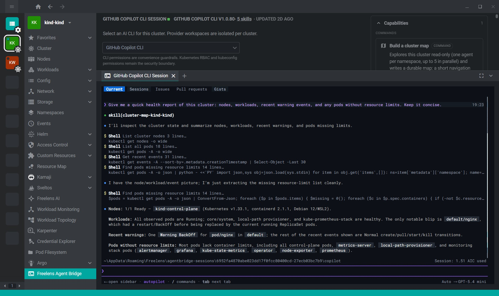

# AgentBridge extension - Agent Harness for Freelens

[](./LICENSE)


Bring an AI coding agent into every Kubernetes cluster you manage — without
leaving Freelens.

Pick [OpenCode](https://opencode.ai/docs/),
[Claude Code](https://docs.anthropic.com/en/docs/claude-code/setup),
[GitHub Copilot CLI](https://docs.github.com/en/copilot/how-tos/set-up/install-copilot-cli),
[OpenAI Codex CLI](https://developers.openai.com/codex/cli/),
or [Pi](https://pi.dev/) per cluster, click one button, and the agent opens
in a docked terminal tab with `KUBECONFIG` already pointed at the active
cluster.

<!-- Suggested: replace this image with a short GIF of the click → session flow -->


## Why use it

Debugging a cluster with an AI agent usually means opening a terminal,
switching kubeconfig context, `cd`-ing somewhere sensible, remembering which
instruction files you set up for this cluster, and hoping you did not point
the agent at the wrong environment. This extension removes all of that:

- **No context mistakes** — the session inherits `KUBECONFIG` from the
  cluster open in Freelens, so the agent always talks to what you're looking
  at.
- **Per-cluster memory** — every cluster keeps its own workspace and
  instructions, so notes for `prod` never leak into `staging`.
- **Safe by default** — pre-seeded permission files allow read-only
  `kubectl`/`helm` and ask for your approval on everything else.
- **Your choice of agent** — switch providers per cluster at any time; the
  selection is remembered.

## Features

- **Five providers** — OpenCode, Claude Code, GitHub Copilot CLI, OpenAI
  Codex CLI, and Pi. Selection persists per cluster and can be changed at any
  time.
- **Bring your own model** — the extension seeds behavior, never a model.
  Four of the five CLIs let you choose the vendor (OpenCode and Pi with your
  own API keys or OAuth, Copilot CLI from GitHub's curated list under one
  subscription, Codex CLI through a custom provider); Claude Code runs
  Anthropic models.
- **One-click sessions** — launches the agent in a Freelens terminal tab
  inside the cluster's workspace, with `KUBECONFIG` and `PATH` wired up.
  Works on macOS, Linux, and Windows (PowerShell).
- **Isolated workspaces** — each cluster and provider pair gets its own
  persistent directory under
  `<userData>/agentbridge-sessions/<safe-cluster-id>/<provider-id>/`.
- **Pre-seeded guardrails** — see the [seeded files table](#how-it-works)
  below for exactly what gets created per provider. Only missing files are
  written, so your edits are never overwritten.
- **In-app editors** — edit every seeded file — instructions, permissions,
  settings, and the command — in a Monaco editor inside Freelens, with
  debounced autosave, syntax highlighting for JSON/TOML/TypeScript/Markdown,
  and an auto/dark/light theme toggle.
- **Workspace artifacts** — see how many skills and custom agents a
  cluster's workspace holds, and when each last changed, without leaving
  the page.
- **Availability checks** — probes the selected CLI on `PATH` (`--version`)
  before offering a session, with a retry action, a link to install docs,
  and a configurable probe timeout.
- **Reveal workdir** — open the cluster's workspace in your native file
  manager.
- **Open in editor** — open the workspace in VS Code or a fork (`codium`,
  `cursor`, ...), falling back to the editor's URL handler if the CLI isn't
  on `PATH`.
- **Reset** — restore the managed files to their bundled defaults (see
  [How it works](#how-it-works) for exactly what's affected). The
  instructions file and everything else you or the agent created are
  preserved.


## Requirements

- Freelens >= 1.8.0
- macOS, Linux, or Windows (PowerShell)
- At least one supported agent CLI on `PATH` (see [Quick start](#quick-start))

## Quick start

### 1. Install an agent CLI

Install at least one of:

- [OpenCode](https://opencode.ai/docs/) — `opencode`
- [Claude Code](https://docs.anthropic.com/en/docs/claude-code/setup) — `claude`
- [GitHub Copilot CLI](https://docs.github.com/en/copilot/how-tos/set-up/install-copilot-cli) — `copilot`
- [OpenAI Codex CLI](https://developers.openai.com/codex/cli/) — `codex`
- [Pi](https://pi.dev/) — `pi`

The extension detects agents on `PATH`; it does not bundle or update them.

### 2. Install the extension

Open Freelens and go to Extensions (`ctrl`+`shift`+`E` or `cmd`+`shift`+`E`),
then search for and install `@freelensapp/agentbridge-extension`.

Alternatively, open this URL in your browser to install directly:
[freelens://app/extensions/install/%40freelensapp%2Fagentbridge-extension](freelens://app/extensions/install/%40freelensapp%2Fagentbridge-extension)

> **Restart Freelens completely after installing or upgrading.** Freelens
> loads extension code into its main process once per app run, so a window
> reload picks up the new UI but leaves the old main process behind.

### 3. Launch a session

Open a cluster, click **Freelens Agent Bridge** in the sidebar, select a
provider, and press **Open session**. Repeat on any other cluster — every
workspace is independent.

## Example: what a session looks like

Open a session on a cluster with a failing deployment and ask, in plain
language:

```text
The checkout pods in namespace shop keep restarting. Find out why and fix it.
```

The agent runs read-only commands immediately (they're pre-allowed):

```text
kubectl get pods -n shop
kubectl describe pod checkout-7d4b9-xkz2p -n shop
kubectl logs checkout-7d4b9-xkz2p -n shop --previous
```

It finds `OOMKilled` with exit code 137, inspects the deployment's resource
limits, and proposes a fix. Because `kubectl apply`, `kubectl edit`, and
`kubectl patch` aren't in the allow-list, the agent asks before running the
mutation — you approve it, and it verifies the rollout and reports back.

<video src="https://github.com/user-attachments/assets/12e1571c-4ac2-42cc-82fb-cd6d5d245213" controls width="600"></video>

*Demo: the agent fixes a deployment's memory limit that was causing pod
restarts.*

Other things people ask in a cluster session:

```text
Which pods in this cluster have no resource limits set?
Compare the image tags running in staging with what the Helm chart defines.
A PVC is stuck in Pending — figure out which StorageClass is the problem.
Summarize the warning events from the last hour and group them by cause.
```

## How it works

Each cluster and provider pair gets a persistent workspace (that will be your agent harness):

```text
<userData>/agentbridge-sessions/<cluster-id>/<provider-id>/<provider-native files>
```

On first open, the extension seeds the workspace with each provider's native
files. Seeding only ever creates files that are absent — an existing file is
left exactly as you last edited it.

| Provider           | Instructions                      | Permissions / settings                                 | Command / skill                             |
| ------------------ | --------------------------------- | ------------------------------------------------------ | ------------------------------------------- |
| OpenCode           | `AGENTS.md`                       | `.opencode/opencode.json`                              | `.opencode/command/build-cluster-map.md`    |
| Claude Code        | `CLAUDE.md`                       | `.claude/settings.json`                                | `.claude/commands/build-cluster-map.md`     |
| GitHub Copilot CLI | `.github/copilot-instructions.md` | `.github/copilot/settings.json`                        | `.github/skills/build-cluster-map/SKILL.md` |
| OpenAI Codex CLI   | `AGENTS.md`                       | `.codex/config.toml`                                   | `.agents/skills/build-cluster-map/SKILL.md` |
| Pi                 | `AGENTS.md`                       | `.pi/extensions/kubectl-guard.ts`, `.pi/settings.json` | `.pi/prompts/build-cluster-map.md`          |

**Reset button** deletes and re-seeds exactly the "Permissions / settings" and
"Command / skill" columns above for the selected provider, discarding any
edits to those specific files. The instructions file, workspace skills and
agents, and anything else the agent created are preserved. The confirm
dialog lists the exact paths before removing anything.

When you launch a session, the extension opens a Freelens terminal tab —
which already carries the active cluster's `KUBECONFIG` via Freelens' built-in
terminal infrastructure — changes into the workspace, and starts the CLI. The
agent picks up its instruction and permission files exactly as it would in
any project directory.

### Codex note
Codex CLI is started with explicit arguments, because two of its defaults
would otherwise break a cluster session before its config file is ever read
(Codex ignores a project's `.codex/` layer until you trust the folder, which
it asks about on first launch):

```sh
codex --sandbox workspace-write --ask-for-approval on-request -c sandbox_workspace_write.network_access=true
```

Command-line flags outrank every config layer, so the session works on the
first launch. As a result: the agent may write inside its own workspace,
`kubectl` can reach the API server (Codex's `workspace-write` sandbox blocks
network access by default), and any command the sandbox doesn't already
permit is still shown to you first.

## Configuring your agent

Everything below is editable directly in Freelens through the in-app
editors, or externally via **Reveal workdir** / **Open in editor**. Because
each cluster has its own workspace, you can give production a strict,
ask-for-everything policy while a local kind cluster runs with broad
permissions.

### Instructions: teach the agent about the cluster

Every provider reads a Markdown instructions file at session start. The
default scaffold sets careful ground rules; extend it with anything the
agent should know about this specific cluster:

```markdown
# Cluster Agent Instructions

This cluster agent uses inherited `KUBECONFIG` from Freelens.

- Inspect resources before mutating them.
- Use an explicit namespace for namespaced resources.
- Ask before destructive or availability-affecting changes.

## Cluster Notes

- This is the EU production cluster; treat every change as customer-facing.
- Deployments are managed by Argo CD — never `kubectl apply` app manifests,
  point me at the Git repo instead.
- Ingress runs on ingress-nginx in namespace `ingress`; cert-manager handles
  TLS.
```

The scaffold ends with a **Cluster Notes** section for exactly this purpose:
ask the agent to record what it learned there, and the knowledge persists
across sessions.

### Permissions

<details>
<summary>OpenCode (`.opencode/opencode.json`)</summary>  
OpenCode uses pattern-based permissions where each rule resolves to `allow`,
`ask`, or `deny` — the default scaffold allows read-only commands and asks
for everything else:

```json
{
  "$schema": "https://opencode.ai/config.json",
  "permission": {
    "bash": {
      "*": "ask",
      "kubectl get *": "allow",
      "kubectl describe *": "allow",
      "kubectl logs *": "allow",
      "helm list *": "allow",
      "kubectl delete *": "deny"
    }
  }
}
```

Add `"kubectl delete *": "deny"`-style rules to hard-block commands, or
promote frequently approved commands (for example
`"kubectl rollout status *": "allow"`) to reduce prompts. See the
[OpenCode permissions docs](https://opencode.ai/docs/permissions/) for the
full syntax, including per-agent overrides.
</details>

<details>
  <summary>Claude Code (`.claude/settings.json` and `CLAUDE.md`)</summary>
Claude Code uses `allow` / `ask` / `deny` lists of tool patterns, where deny
always wins:

```json
{
  "permissions": {
    "allow": [
      "Bash(kubectl get:*)",
      "Bash(kubectl describe:*)",
      "Bash(kubectl logs:*)",
      "Bash(helm list:*)"
    ],
    "ask": ["Bash(kubectl apply:*)", "Bash(kubectl rollout restart:*)"],
    "deny": ["Bash(kubectl delete namespace:*)"]
  }
}
```

`CLAUDE.md` in the workspace root holds the instructions. See the
[Claude Code settings docs](https://code.claude.com/docs/en/settings) for
the full pattern syntax, environment variables, and hooks.
</details>

<details>
  <summary>GitHub Copilot CLI (`.github/copilot-instructions.md`)</summary>
  Copilot CLI reads `.github/copilot-instructions.md` automatically and asks
interactively before running file-modifying tools; you can approve a tool
once or for the rest of the session. Session-level configuration lives in
the CLI itself via the `/settings` slash command. See the
[Copilot CLI docs](https://docs.github.com/en/copilot/how-tos/use-copilot-agents/use-copilot-cli)
for details.
</details>

<details>
  <summary>Codex CLI (`.codex/config.toml` and `AGENTS.md`)</summary>
  Codex reads `AGENTS.md` from the workspace and takes its policy from TOML:

```toml
approval_policy = "on-request"
sandbox_mode = "workspace-write"

[sandbox_workspace_write]
network_access = true
writable_roots = ["/path/to/this/workspace/.agents"]
```

Two Codex-specific things are worth knowing:

- **Trust.** Codex loads a project's `.codex/` layer only after you trust
  the folder, and it asks the first time a session opens. Until you answer,
  this file has no effect — which is why the extension also passes the
  sandbox, approval, and network settings as launch flags.
- **Read-only paths.** Codex keeps `.agents/`, `.codex/`, and `.git/`
  read-only even inside a writable workspace. `build-cluster-map` writes its
  per-namespace skills under `.agents/skills/`, so Codex asks for approval
  before each one. Add this workspace's own `.agents` directory to
  `writable_roots` (an absolute path — **Reveal workdir** gives it to you)
  to let them through without prompting.

Codex has no project-local slash commands, so the cluster map ships as a
skill: mention it with `$build-cluster-map`, or pick it from `/skills`.
Custom subagents go in `.codex/agents/*.toml` and are counted in the
workspace artifacts panel. See the
[Codex configuration docs](https://developers.openai.com/codex/config/) for
the full key reference.
</details>

<details>
  <summary>Pi (`.pi/extensions/kubectl-guard.ts`, `.pi/settings.json` and `AGENTS.md`)</summary>
  Pi reads `AGENTS.md` from the workspace and keeps everything else under
`.pi/`. It intentionally ships no MCP, no sub-agents, no permission popups,
and no sandbox, so its guardrail is code: the seeded
`.pi/extensions/kubectl-guard.ts` is a `tool_call` hook that runs before
every shell tool call. It lets through the same read-only `kubectl`/`helm`
commands the other providers allow, and holds everything else — `delete`,
`apply`, `scale`, `drain`, `exec`, `helm upgrade`, and anything it doesn't
recognize — for confirmation, blocking it if you decline or if no UI is
attached to ask. Commands that touch neither tool are not intercepted.

`.pi/settings.json` carries the rest:

```json
{
  "defaultTools": ["read", "bash", "powershell", "edit", "write", "grep", "find", "ls"],
  "sessionDir": ".pi/sessions"
}
```

`defaultTools` adds Pi's search built-ins to its four defaults, and
`sessionDir` keeps this cluster's transcripts inside its own workspace
instead of the shared `~/.pi/agent/sessions/`. A project `defaultTools`
array **replaces** the one in your global settings rather than merging with
it — `powershell` is listed for that reason, so a Windows user who selected
it globally doesn't lose it inside a cluster workspace. Trim the array to
take a tool away from the agent.

Five Pi-specific things are worth knowing:

- **Trust.** Pi asks once per workspace, on the first interactive launch,
  and remembers the answer in `~/.pi/agent/trust.json`. Until the workspace
  is trusted, the guard extension, `.pi/settings.json`,
  `.pi/prompts/build-cluster-map.md`, and any `.pi/skills/` are not loaded —
  the session still starts and still talks to the cluster, just ungated,
  with `AGENTS.md` (which is never trust-gated) as its only instruction.
  Declining trust gives you *fewer* guardrails, not more.
- **No sandbox.** Pi's built-in tools run with the permissions of the `pi`
  process, by design. The guard is a convenience, not a boundary: it lives
  in a directory the agent itself can write to, and a session can be talked
  into working around it. As with every other provider, the kubeconfig and
  Kubernetes RBAC remain the only enforcement boundary — pair a cluster
  session with a read-only context when that matters.
- **A broken guard file stops Pi from starting.** It's executable
  TypeScript, so a syntax error makes Pi exit with `Failed to load
  extension … ParseError` instead of opening a session. Start Pi with
  `pi -ne` to skip extensions, or press **Reset** on this page to restore
  the file.
- **No sub-agents.** Pi has none, so the workspace artifacts panel shows
  skills only — there's no "agents" chip to miss — and
  `/build-cluster-map` explores namespaces sequentially rather than
  delegating them in parallel.
- **Models.** Pi is model-agnostic: switch with `/model` or `Ctrl+L` inside
  a session, or start it as `pi --provider … --model …`. The extension
  seeds no model.

On its first interactive launch, Pi downloads `fd` and `ripgrep` into
`~/.pi/agent/bin`; behind a blocked network that prints a cosmetic `Failed
to download fd` warning, which installing system `fd`/`rg` or setting
`PI_OFFLINE=1` silences. See the [Pi docs](https://pi.dev/docs/latest) for
extensions, settings, and prompt templates.
</details>

### Extension preferences

Under **Preferences → Extensions → Freelens Agent Bridge**:

- **Version probe timeout (ms)** — how long to wait for a CLI to answer
  `--version` before reporting an error. Increase it on slow machines or
  network filesystems.
- **Editor command** — the CLI used by **Open in editor** (default `code`).
  Set it to `codium`, `cursor`, or another VS Code fork. On macOS, run
  "Shell Command: Install 'code' command in PATH" from VS Code first.

## Security model

CLI permission files — and, on Pi, the seeded guard extension — are
provider-native convenience guardrails: they control what the agent asks
before doing, inside its own session. They do not grant or restrict
Kubernetes access. **Kubernetes RBAC and your kubeconfig permissions remain
the security boundary** — the agent can never do more against the cluster
than the kubeconfig Freelens hands it allows.

## More demos

The agent fixes a missing secret that crashes the pod:

<video src="https://github.com/user-attachments/assets/3e404238-8e21-4363-ad9f-783a9bd41790" controls width="600"></video>

## Build from the source

`pnpm pack:dev` builds a prerelease `.tgz` you can install straight from the
Freelens Extensions page. Full dev setup, build, test, and debugging
instructions live in [CONTRIBUTING.md](./CONTRIBUTING.md).

## Authors

- [@leo-capvano](https://github.com/leo-capvano)

## License

[MIT](./LICENSE) © 2025-2026 Freelens Authors
