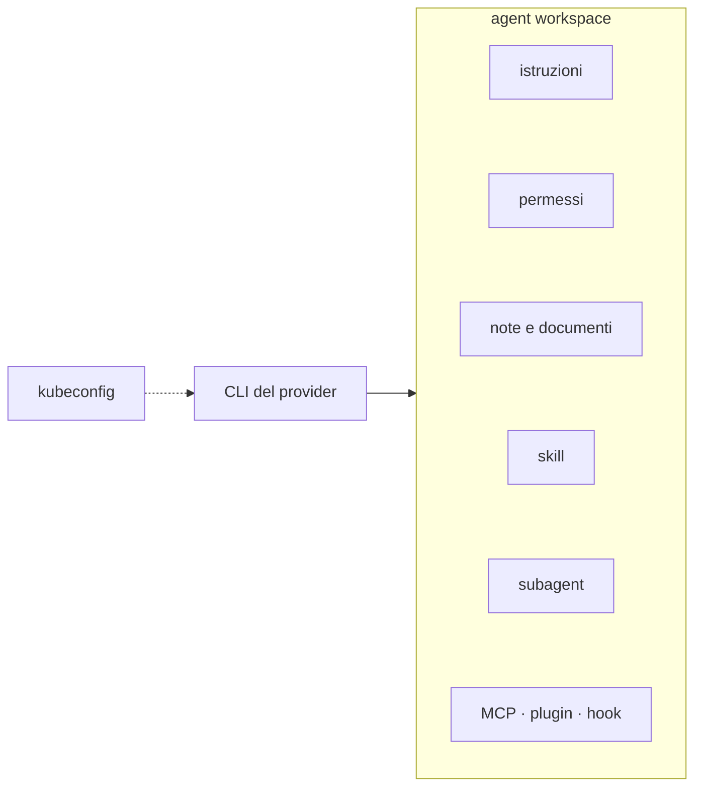
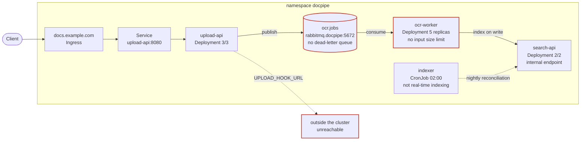

# Non è che scrive kubectl più veloce di te (anche se lo fa)

*Una giornata di lavoro su Kubernetes con un agent AI dentro Freelens.*

> Non ho alcun coinvolgimento nel progetto Freelens né nell'estensione di cui si
> parla qui: è solo software che uso.


## Il costo nascosto non sono i comandi

Alert alle 9:40: un servizio della pipeline documentale ha smesso di processare qualsiasi cosa.

Prima di fare qualcosa di utile devi rispondere a quattro domande che non
parlano di Kubernetes: quale cluster, quale namespace, chi chiama chi in quella
pipeline, e cosa avevi già scoperto l'ultima volta. Le prime tre risposte le hai in
testa, la quarta è sepolta in un thread Slack di tre mesi fa.

I comandi sono l'ultima parte del problema. Il contesto è quello che costa davvero,
e lo paghi ogni volta da zero.

Un agent AI che sa scrivere `kubectl` ti fa risparmiare la parte piccola. Un
agent che parte già sapendo dove si trova ti fa risparmiare il resto. Tutta la
differenza tra un terminale con un'AI dentro e un ambiente di lavoro in cui
l'AI ha memoria sta lì.

## Cos'è un agent workspace

Un terminale con un coding agent dentro è senza stato: apri, chiedi, chiudi, e la
volta dopo riparti da zero. La memoria del contesto resta tutta tua.

Un *agent workspace* è l'opposto: una directory di lavoro dedicata dove
l'agente vive. Dentro c'è tutto il suo harness, cioè l'insieme di cose che gli
dicono come comportarsi, cosa sa e cosa può fare. I nomi dei file cambiano da
provider a provider, i livelli restano gli stessi:

- **Hot memory.** Il file di istruzioni letto a ogni inizio sessione —
  `AGENTS.md`, `CLAUDE.md`, `copilot-instructions.md`. Regole stabili,
  convenzioni, avvertenze. Deve restare corto: è sempre nel contesto, e lo paghi
  a ogni messaggio.
- **Permessi.** Il file che dice cosa l'agente può fare senza chiedere: quali
  comandi passano da soli, quali si fermano in attesa di un sì. È il confine tra
  autonomia e controllo, ed è uno dei file che AgentBridge ti prepara in
  anticipo.
- **Memoria a lungo termine.** Documenti, note, diagrammi, una wiki tenuta
  aggiornata dall'agente stesso: tutto ciò che non entra nella memoria calda e
  che l'agente apre quando ne ha bisogno. È lo spazio in cui un'esplorazione
  diventa un appunto che resta.
- **Memoria operativa.** Le skill: procedure con un nome e una descrizione, che
  l'agente richiama quando la situazione lo richiede. Una mappa del namespace, un
  runbook di troubleshooting, una checklist di upgrade. È il livello che
  trasforma un giro fatto una volta in un gesto riusabile.
- **Agenti e subagent.** Definizioni di agenti specializzati — con strumenti e
  istruzioni propri — e la possibilità di lanciarne più in parallelo sullo
  stesso compito.
- **Estensioni varie.** Server MCP, plugin, hook: strumenti extra e
  automazioni, quando il CLI le supporta. Non sono l'essenziale, ma è lì che
  un harness cresce davvero.

Questa organizzazione ha un nome, comparso all'inizio del 2026: *harness
engineering*. La formula che circola è `Agent = Model + Harness`, e il
workspace è la parte di harness che possiedi tu — quello che Birgitta
Böckeler chiama [outer
harness](https://martinfowler.com/articles/harness-engineering.html), distinto
da quello che ogni CLI porta già con sé. La tassonomia qui sopra è la stessa
che trovi in
[letteratura](https://www.langchain.com/blog/the-anatomy-of-an-agent-harness),
solo riorganizzata attorno a come si usa un cluster.

La composizione, in un colpo d'occhio:



## Cosa ci mette AgentBridge

[AgentBridge](https://github.com/freelensapp/freelens-agentbridge-extension) è
un'estensione di [Freelens](https://freelens.app) che **ti costruisce l'agent workspace al posto tuo**.
Apri un cluster, scegli il provider — OpenCode, Claude
Code, GitHub Copilot CLI o OpenAI Codex CLI — e avvii la sessione in una tab
del terminale agganciata a Freelens. Quando il prompt appare, tre cose sono già
a posto: `KUBECONFIG` punta al cluster che hai aperto, la directory di lavoro
è `<userData>/agentbridge-sessions/<cluster-id>/<provider-id>/`, e dentro trovi
già un file di istruzioni e un file di permessi, nel formato che il provider
si aspetta.

Il seeding non è distruttivo: quello che scrivi tu sopravvive agli
aggiornamenti, e i tre file gestiti — istruzioni, permessi, comando — si
modificano da un editor dentro Freelens. Il resto dell'harness lo riempi
lavorando: la memoria a lungo termine, le skill e gli agenti custom nascono
dalle sessioni, oppure li aggiungi tu a mano, perché la directory resta una
directory normale.

Il workspace è persistente e separato per ogni coppia cluster+provider. Quello
che l'agente impara su produzione non finisce nel contesto di staging, e la
mappa che costruisce oggi è ancora lì lunedì prossimo.

Un'ultima nota: OpenCode, uno dei provider, è anche uno degli 11 harness
passati al setaccio in [questo studio sul loro codice
sorgente](https://arxiv.org/abs/2609.00006) — utile se vuoi capire cosa c'è
sotto.

## Quanta autonomia hai davvero

La domanda interessante viene dopo: quanta strada fa l'agent prima di doverti
chiedere qualcosa?

Con il profilo di default, le letture passano da sole: `get`, `describe`,
`logs`, `explain`, `api-resources`, `auth can-i`, `top`, `version`, più le
letture `helm`. Tutto il resto — `apply`, `patch`, `delete`, `scale`, `exec` —
si ferma e chiede. In pratica: l'analisi è autonoma, la modifica ha un gate.

Il gate sta nel file dei permessi del workspace ed è per cluster. Su produzione
lo tieni stretto, su un cluster kind puoi allargarlo quanto vuoi, su staging
puoi permettere `rollout restart` senza permettere `delete`. È il punto dove
decidi tu il grado di autonomia, invece di subirlo. La modifica si fa
dall'editor e vale dalla sessione successiva.

Sopra tutto questo c'è il confine che conta davvero: l'RBAC del kubeconfig che
Freelens passa all'agent. Non potrà mai fare più di quanto puoi fare tu.

Quanto lavoro scorre dietro un gate che non chiede? Prendi il comando di
mappatura che vedi tra poco: un subagent per namespace, fino a cinque in
parallelo, e decine di comandi di lettura incatenati tra loro. Il gate resta
su un solo gesto, quello che cambia lo stato.

Il resto dell'articolo racconta una giornata. Cluster `prod-eu-1` e `staging-eu-1`,
namespace `docpipe`, una pipeline che prende PDF e li rende cercabili:
`upload-api`, `ocr-worker`, `doc-store`, `indexer`, `callback-dispatcher`,
`search-api`. Nella giornata uso OpenCode; con gli altri provider cambiano i
nomi dei file e i meccanismi di approvazione, non l'idea di fondo.

## Mattina — un cluster che non hai mai visto

Sei in `prod-eu-1` da ieri. Freelens ti mostra ventidue deployment in sei
namespace. Sai i nomi dei servizi, non sai come si parlano tra loro.

```
Ricostruisci come funziona la pipeline nel namespace docpipe: chi chiama chi,
cosa sta in mezzo, dove sono i punti di rottura. Salva la mappa dove la
ritrovi domani.
```

Il comando `/build-cluster-map`, che l'estensione pre-installa nel workspace,
fa esattamente questo giro, se preferisci non scrivere il prompt a mano. È
read-only e idempotente: alla seconda esecuzione aggiorna quello che c'è invece
di duplicarlo.

**Cosa ha fatto al posto tuo** — tutto in lettura, già autorizzato nel
workspace:

1. Elencato deployment, service, ingress e ConfigMap del namespace.
2. Incrociato i selector dei service con le label dei pod, per capire chi
   risponde davvero a cosa e non chi *dovrebbe*.
3. Letto le variabili d'ambiente dei container, che è dove i servizi dichiarano
   chi chiamano.
4. Guardato le probe e il numero di repliche di ognuno.
5. Sfogliato i log dei servizi per vedere quali rotte compaiono e con quale
   frequenza, e per raccogliere gli identificativi di correlazione che legano
   una richiesta all'altra.
6. Scritto il risultato in una skill per namespace e in una skill di cluster,
   più un blocco di navigazione corto nel file di istruzioni.

**L'esito.** La mappa non è quella che avresti disegnato tu. Il servizio si
chiama `indexer`, quindi avresti immaginato che indicizzi i documenti appena
usciti dall'OCR. Invece `indexer` è un batch notturno di riconciliazione;
l'indicizzazione in tempo reale la fa `search-api` su un endpoint interno. Il
nome mentiva, come mentono i nomi dopo due anni di refactoring.

Quella mappa non resta in chat: è un file, e assomiglia a questo.

```markdown
---
name: ns-map-docpipe
description: Map of the docpipe namespace in prod-eu-1 — workloads,
  services, config, storage, RBAC, risks. Load when working in this namespace.
---
## Workloads
- upload-api (Deployment, 3/3) → Service upload-api:8080 → Ingress docs.example.com
- ocr-worker (Deployment, 5 replicas) ← queue ocr.jobs (rabbitmq.docpipe:5672)
- indexer (CronJob, 02:00) → nightly reconciliation, not real-time indexing
- search-api (Deployment, 2/2) → indexes on write, internal endpoint
## Config
- ConfigMap ocr-worker-config: no input size limit (names and keys only)
## Risks
- ocr.jobs has no dead-letter queue
- UPLOAD_HOOK_URL points outside the cluster, unreachable from here
```

Da domani ogni domanda su `docpipe` parte già informata: l'agent carica la
skill quando serve, e il blocco di navigazione risponde a "quale namespace
contiene X" senza dover esplorare niente.


Nella skill c'è anche il diagramma dell'architettura, ricavato dalle stesse
letture:



## Metà mattina — `ocr-worker` riavvia in loop

Freelens ti mostra cinque pod `ocr-worker`, tre in `CrashLoopBackOff`. I restart
sono 12, 9, 3, 0, 0. Nessun deploy da ieri. Quindi non sei stato tu a romperlo,
almeno non oggi.

```
I pod ocr-worker nel namespace docpipe riavviano in loop. Capisci perché.
```

**Cosa ha fatto al posto tuo** — di nuovo, tutto pre-autorizzato:

1. Elencato i pod e notato che i restart sono sparpagliati, non uniformi. Se
   fosse carico generale sarebbero simili.
2. Guardato lo stato precedente di ognuno: `OOMKilled`, exit 137.
3. Letto i log del container precedente su due pod diversi. Entrambi si
   fermano sulla stessa riga: `processing document doc_84f2c1`.
4. Scartato l'ipotesi memoria: un worker troppo piccolo morirebbe su documenti
   diversi, non sempre sullo stesso.
5. Letto la ConfigMap del worker: nessun limite sulla dimensione dei file in
   ingresso.
6. Guardato eventi e profondità della coda: quel messaggio è stato riconsegnato
   decine di volte.

**Dove si è fermato.** Propone tre cose: alzare la memoria come patch,
mettere una guardia sulla dimensione in ingresso, configurare una dead-letter
queue. Le prime due toccano il deployment, e `kubectl patch` non è nella lista
dei permessi di questo workspace: si ferma e chiede. Autorizzi solo la patch;
guardia e dead-letter finiscono in un branch, dove vanno discusse con calma.

La richiesta di approvazione mostra esattamente cosa sta per succedere:

```
$ kubectl -n docpipe patch deployment ocr-worker --type=json \
    -p '[{"op":"replace","path":".../limits/memory","value":"2Gi"}]'
Allow? [y/N]
```

Su questo cluster il gate è al suo posto perché sei tu che l'hai lasciato lì.
Su `staging-eu-1`, se avessi pre-approvato `kubectl patch` nel profilo di
quel workspace, lo stesso comando sarebbe passato senza chiedere. Stessa AI, due
profili di rischio: la differenza l'ha fatta una decisione presa una volta, non
la disciplina del momento.

**L'esito.** La memoria è il sintomo. Il problema vero è un documento che avvelena la
coda: un PDF scansionato enorme che ogni worker prende, prova a elaborare, ed
esaurisce la RAM. La coda non riceve conferma e glielo rispedisce dopo. Il
loop non gira intorno ai pod, gira intorno a quel messaggio.

Alzare la memoria e chiudere lì, come suggeriva `OOMKilled` alle 9:40, avrebbe
tenuto in piedi i worker giusto il tempo di masticare quel documento, lasciando
intatto lo stesso problema per il prossimo file grosso. La differenza l'ha
fatta il confronto tra i log di due pod invece di uno: è il passaggio che salti
sempre, quando hai già in testa una risposta plausibile.


## Prima di pranzo — la modifica prima dell'apply

Hai il manifest col nuovo limite di memoria per `ocr-worker`. Sintatticamente è
corretto. La review l'ha fatta chi ha guardato il diff, non il cluster.

```
Questo manifest sta per andare su docpipe. Confrontalo con quello che gira
adesso e dimmi cosa si potrebbe rompere.
```

**Cosa ha fatto al posto tuo** — solo letture, quindi nessuna conferma
richiesta:

1. Letto il deployment vivo e confrontato campo per campo con il file.
2. Guardato `ResourceQuota` e `LimitRange` del namespace, che è il contorno che
   nel diff non si vede.
3. Contato le repliche attuali, per moltiplicare il nuovo limite su quelle vere
   e non su quelle dichiarate nel chart.

**Dove si è fermato.** Prima dell'`apply`. Ha preparato il comando e chiesto,
come previsto dai permessi.

**L'esito.** Due cose che il diff non poteva vedere. La prima: il namespace ha
una `ResourceQuota` sulla memoria quasi esaurita, e il nuovo limite per tre
repliche non ci sta dentro. L'`apply` passa la validazione, il ReplicaSet non
riesce a creare i pod, e finisci a debuggare un rollout bloccato invece di un
crash. La seconda: il deployment che gira ha una env var che nel chart non
esiste — qualcuno l'ha aggiunta a mano mesi fa, e il tuo apply la cancella.

Il diff era corretto. Era il cluster a essere diverso da come lo immaginavi. E
l'agent non stava valutando il manifest in astratto: guardava questo cluster,
perché è l'unico a cui è collegato.

## Pomeriggio — il bug che si vede solo in cluster

`callback-dispatcher` non va in crash e non mostra errori evidenti.
Semplicemente alcuni callback agli utenti non arrivano. In locale il servizio
funziona. In staging funziona.

```
Alcuni callback non partono. Qui trovi il log del servizio, il checkout del
repo è in ~/src/callback-dispatcher. Guardali insieme.
```

**Cosa ha fatto al posto tuo.**

1. Filtrato il log applicativo sul pattern dei timeout, che era l'unica cosa
   ricorrente.
2. Aperto nel repo il punto in cui viene letta la configurazione.
3. Letto la ConfigMap viva del servizio e confrontato le chiavi con quelle che
   il codice cerca.

**Dove si è fermato.** Ha trovato la correzione, ma è una modifica alla
ConfigMap: chiede. E il fix nel repo lo propone come diff da rivedere, non lo
committa.

**L'esito.** Avresti guardato nella logica di retry. La causa era altrove: una
chiave rinominata. Il codice legge `callback_timeout_ms`, la ConfigMap in
produzione dichiara ancora `callbackTimeoutMs`. Nessun errore, nessun log: il
parser non trova la chiave e usa il default, troppo basso per i clienti lenti.
Funzionava in staging solo perché lì la ConfigMap era già stata aggiornata.

Il path del checkout resta nelle sue istruzioni: la prossima volta che un bug
attraversa il confine tra codice e cluster, sa già dove guardare da entrambi i
lati.

## Sera — audit, postmortem, runbook

Sono le 18. L'incidente è chiuso, la patch applicata, e su Freelens è tutto
verde — che è proprio il momento peggiore per fidarsi. Restano le due cose che
di sera si rimandano sempre: mettere tutto a verbale e capire chi sarà il
prossimo a saltare.

```
Tre cose. Uno: in docpipe trovami ogni container senza requests, ogni
deployment a replica singola, ogni pod senza probe. Due: ricostruisci la
timeline di stamattina, separando quello che abbiamo verificato da quello che
abbiamo supposto. Tre: trasforma il giro di stamattina in un runbook riusabile.
```

**Cosa ha fatto al posto tuo** — le prime due sono letture pre-autorizzate, la
terza scrive solo dentro il suo workspace:

1. Scritto lui il `jsonpath` che tu non ricordi mai a memoria, e passato tutti
   i deployment del namespace, non solo quelli che avevi in testa.
2. Ricostruito la timeline da eventi e conteggi di restart, segnando riga per
   riga cosa è verificato e cosa è ipotesi.
3. Salvato la procedura di stamattina come skill di troubleshooting nel
   workspace: dalla lettura dei restart alla verifica della coda, con i comandi
   e i punti di decisione.

**Dove si è fermato.** Non su un permesso: su una domanda. Quali passi di
stamattina vanno nel runbook e quali erano specifici di quel singolo documento.
È l'unica parte che non può decidere da solo.

**L'esito.** Ti aspetteresti che l'audit puntasse il dito su `ocr-worker`, il
servizio che ti ha fatto perdere la mattina. Invece il punto fragile è
`callback-dispatcher`: una sola replica, nessuna liveness probe, nessun
`requests`. Il servizio silenzioso che nessuno guarda è sempre quello giusto da
controllare. E la distinzione tra verificato e supposto — quella che nei
postmortem scritti a mano di sera finisce sempre per sparire — questa volta è
nero su bianco nel documento.

Il runbook è una skill nel workspace: la prossima sessione la trova già pronta,
e committata nel repo di team diventa una procedura condivisa invece
dell'ennesima pagina di wiki. Il pannello *Workspace artifacts* nel frattempo ti
mostra cosa l'agent ha prodotto, mentre in una seconda tab lo stesso audit gira
su `staging-eu-1`, con permessi più larghi e note separate.

## Casi d'uso che non stanno in una giornata

La giornata qui sopra è solo un campione. Il workspace si presta a molto altro.

- **Runbook di remediation e troubleshooting.** Un percorso di diagnosi
  codificato una volta e riusato; nel repo del team vale per tutti.
- **Onboarding su un cluster nuovo.** `/build-cluster-map` il primo giorno, e
  dal secondo le domande partono da una mappa invece che da zero.
- **Pre-check di upgrade.** API deprecate, PDB, quote e limiti prima di alzare
  la versione del cluster, quando l'errore costa molto più della verifica.
- **Drift detection.** Confronto tra ciò che gira e ciò che il chart dichiara:
  le modifiche a mano, come la env var di stamattina, vengono fuori prima di
  essere cancellate da un apply.
- **Audit periodico di postura.** Repliche singole, probe mancanti, `requests`
  assenti, NetworkPolicy: la lista di sera, trasformata in controllo ricorrente.
- **Capacity e costi.** Con metrics-server o Prometheus i numeri ci sono; senza,
  resta una stima, non una cifra su cui firmare.

Questi sono solo alcuni esempi di cosa si può chiedere a un coding agent che
vive nel tuo cluster: qui il limite è solo la tua fantasia.

## Dove non credergli

Tre confini, ed è bene tenerli a mente.

**Il file dei permessi non è sicurezza.** Controlla cosa l'agent chiede prima
di fare, dentro la sua sessione. Il confine vero è l'RBAC del kubeconfig che
Freelens gli passa: l'agent non potrà mai fare più di quanto puoi fare tu.


## Chiusura

La cosa che cambia dopo un mese non è la velocità con cui scrivi i comandi.

È che il workspace del cluster ha smesso di essere una semplice directory di
configurazione. Dentro ci sono la mappa della pipeline, il fatto che `indexer`
non indicizza niente, la nota che quella coda non ha una dead-letter, il path
del repo, il runbook della mattina. È la documentazione del cluster che per
una volta è aggiornata, perché la aggiorna chi la usa mentre la usa — non una
persona designata, il venerdì pomeriggio, su un wiki che nessuno apre mai.

- [Estensione AgentBridge](https://github.com/freelensapp/freelens-agentbridge-extension)
- [OpenCode](https://opencode.ai/docs/) · [Claude Code](https://docs.anthropic.com/en/docs/claude-code/setup) · [GitHub Copilot CLI](https://docs.github.com/en/copilot/how-tos/set-up/install-copilot-cli) · [OpenAI Codex CLI](https://developers.openai.com/codex/cli/)

## Per approfondire

Se il capitolo sul workspace ti ha incuriosito, l'impianto viene da qui.

**Harness engineering**

- [Harness engineering for coding agent users](https://martinfowler.com/articles/harness-engineering.html) — Martin Fowler / Birgitta Böckeler
- [The Anatomy of an Agent Harness](https://www.langchain.com/blog/the-anatomy-of-an-agent-harness) — LangChain
- [Harness engineering: leveraging Codex in an agent-first world](https://openai.com/index/harness-engineering/) — OpenAI

**Memoria, contesto e skill**

- [Effective context engineering for AI agents](https://www.anthropic.com/engineering/effective-context-engineering-for-ai-agents) — Anthropic
- [Equipping agents for the real world with Agent Skills](https://www.anthropic.com/engineering/equipping-agents-for-the-real-world-with-agent-skills) — Anthropic
- [Voyager: An Open-Ended Embodied Agent with Large Language Models](https://arxiv.org/abs/2305.16291) — la skill library prima delle skill

**Standard**

- [AGENTS.md](https://agents.md/)
- [Model Context Protocol](https://modelcontextprotocol.io/)

**Studi accademici**

- [Harness Engineering: Anatomy, Architecture, and Evolution of Coding Agents](https://arxiv.org/abs/2609.00006) — undici harness a confronto, OpenCode incluso
